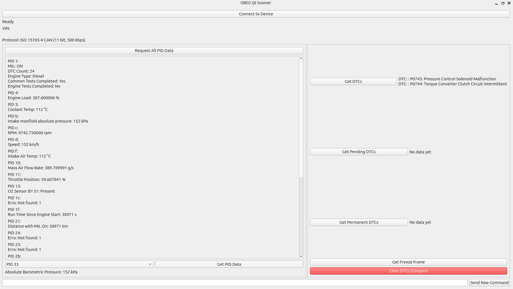

# OBD2-Scanner-Library

A lightweight and flexible **OBD-II communication library for PC**.
The goal is to provide a single codebase that works across different transport protocols, so the same application logic can run unchanged on top of ELM327 or SocketCAN.

Currently available for:

- **Linux** 
    - Via [SocketCAN](https://www.kernel.org/doc/Documentation/networking/can.txt)
    - [ELM327](https://cdn.sparkfun.com/assets/learn_tutorials/8/3/ELM327DS.pdf) adapter.

Other platforms are planned:

- **Arduino** 🚧 Work in progress

- **Raspberry Pi Pico SDK** 🚧 Work in progress

This project is still in development.
---

## ✨ Features
- Documented API
- Support for multiple OBD-II transport layers: **SocketCAN**, **ELM327**.
- Easy interface(API) for sending OBD requests (`mode`, `PID`).
- Ready for integration into diagnostic or telematics projects.
- Can run the same application over different transports with minimal changes.
- Real-world tested with a commercial ELM327 adapter on a vehicle.
- Now the library also supports real ELM327 adapters over USB or Bluetooth. You can connect your ELM327 and send/receive CAN frames directly.

---

## 🛠 Building & Usage

### Linux(PC)

Two example applications are included:

---

#### 🔹 Console Example  

The **console example** shows how to use the library in a simple C++ program.  
You can modify `example/main.cpp` to call your desired methods (for example `getPid`, `clearDTC`, `getDTC`, etc.).

Optional: Start the Car simulator before launching the application to receive responses, **IMPORTANT** carSimulator use SocketCAN transport layer, so **make sure you use SocketCAN transport layer** in order to receive responses.

To build and run:  

```bash
make simple
./carSimulator.sh & #optional
./main
```

Or simply run the helper script that starts everything for you(included carSimulator):

```bash
./run_example.sh
```

#### 🔹 Qt Example

The **Qt example** demonstrates how to build a graphical interface on top of the library.
Make sure you have the necessary Qt development packages installed before building.

Optional: Start the Car simulator before launching the application to receive responses, **IMPORTANT** carSimulator use SocketCAN transport layer, so **make sure you use SocketCAN transport layer** in order to receive responses.

To build and run:

```bash
make qt
./carSimulator.sh & #optional
./qt_example
```

Or use the helper script that does it automatically:

```bash
./run_exampleQT.sh
```



### Roadmap

- Arduino build.

- Raspberry Pi Pico SDK build.

### 📬 Contact

Questions, contributions, or suggestions are welcome!

- 📧 natanael_ruben@hotmail.com
- 💻 Open an issue or pull request on GitHub